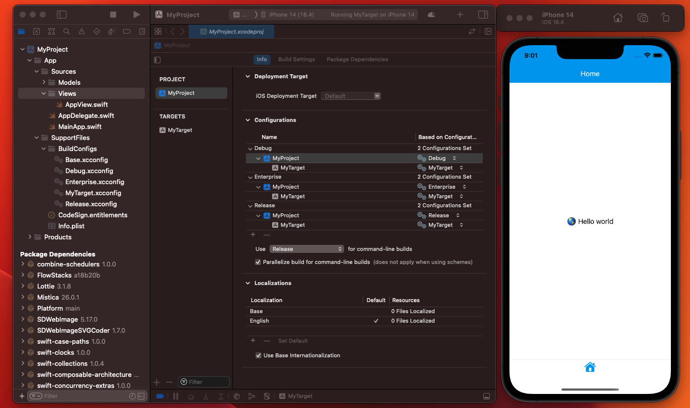

# Generating a new iOS project

This repository offers the possibility to generate a new iOS project with some features out of the box:

* Xcode build **configuration files** for Debug/Enterprise/Release (no more custom Build Settings). Each configuration has already defined its signing profiles and team.
* `@main` will start an application with an `AppDelegate` that has linked the SwiftUI app lifecycle with a basic `Reducer`. You will have already configured `Logger`, `Tweaks`, `Mistica` style and build types. Additionally `Tweaks` will be shown if you shake your device.
* Dependencies and linked libraries with the target:
    - Mistica ([mistica-ios](https://github.com/Telefonica/mistica-ios))
    - Platform ([novum-platform-ios](https://github.com/Telefonica/novum-platform-ios))
    - Composable Arquitecture ([swift-composable-architecture](https://github.com/pointfreeco/swift-composable-architecture)). 
* `DEBUG` and `API_ENVIRONMENT_OVERRIDE` preprocessors.
* Entitlements and `Info.plist` files.
* GitHub pull request template and gitignore file.
* Swift format config and binary



## How to use

With the tool [XcodeGen](https://github.com/yonaskolb/XcodeGen) we can define a `project.yml` that will generate an Xcode project for us.

1. Install XcodeGen
    ```
    brew install xcodegen
    ```

1. Replace `MyProject` and `MyTarget` with your project name and target on `project.yml`.

1. Rename App/SupportFiles/BuildConfigs/`MyTarget`.xcconfig

1. Generate the xcodeproj and opening it in Xcode
    ```
    xcodegen generate && open *.xcodeproj
    ```
## Configuration steps on Xcode

We need one more step on Xcode to make use of Xcode build configuration files for Debug/Enterprise/Release. Remember to change MyProject and MyTarget with the ones you replaced before:

1.  Go to `Project` > `Targets` > `MyTarget` > `Build Settings` and remove all `Customized` settings.

1. Go to `Project` > `MyProject` > `Build Settings` and remove all `Customized` settings.

1. Go to `Project` > `MyProject` > `Info` > `Configuration` and select on each config the corresponding project config. So for `Debug`/`Enterprise`/`Release`. > `MyProject` replace `None` by `Debug`/`Enterprise`/`Release` and leave MyTarget with `MyTarget` config.

## Signing & Capabilities

Optionally you can define your bundle identifier by opening `MyTarget.xcconfig` replacing occurrences of `PlaceYourAppIdHere` and configure the corresponding provisioning profile once they are created.